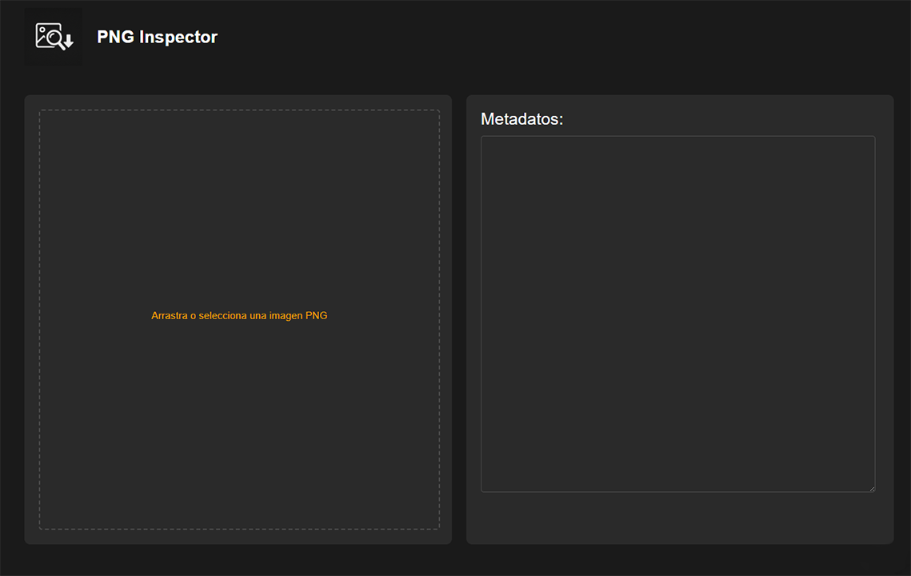

# PNG Inspector RW

[](https://www.python.org/downloads/)
[](https://opensource.org/licenses/MIT)

PNG Inspector RW es una herramienta web para visualizar y editar metadatos de imágenes PNG, con soporte especial para parámetros de generación de IA (como Stable Diffusion). La aplicación permite ver, modificar y guardar metadatos en imágenes PNG de manera sencilla e intuitiva.

## Características

- Visualización de metadatos de imágenes PNG
- Edición de metadatos existentes
- Soporte para parámetros de generación de IA (Stable Diffusion, etc.)
- Interfaz web intuitiva y fácil de usar
- Compatible con cualquier navegador moderno
- Preserva la calidad original de la imagen al guardar
- Soporte para arrastrar y soltar imágenes
- Visualización previa de la imagen cargada

## Vista Previa


*Interfaz de usuario de PNG Inspector RW*


*Panel de visualización de metadatos*

## 📋 Requisitos

- Python 3.7 o superior
- pip (gestor de paquetes de Python)

## Instalación Rápida

1. Clona el repositorio:
   ```bash
   git clone https://github.com/Ferreyrajp/PNG-InspectorRW.git
   cd PNG-InspectorRW
   ```

2. Instala las dependencias:
   ```bash
   pip install -r requirements.txt
   ```

3. Ejecuta la aplicación:
   ```bash
   # Windows
   .\run.bat
   
   # Linux/macOS
   chmod +x run.sh
   ./run.sh
   ```

4. Abre tu navegador y ve a:
   ```
   http://localhost:8081
   ```

## Uso

1. **Cargar una imagen**:
   - Haz clic en el área de carga o arrastra una imagen PNG al recuadro punteado
   - La imagen se mostrará en el panel izquierdo

2. **Ver metadatos**:
   - Los metadatos de la imagen se mostrarán automáticamente en el panel derecho
   - Los metadatos pueden incluir información EXIF, parámetros de IA y otros datos incrustados

3. **Editar metadatos**:
   - Modifica directamente el texto en el área de metadatos
   - El botón "Guardar" aparecerá automáticamente cuando hayas realizado cambios

4. **Guardar la imagen**:
   - Haz clic en el botón "Guardar"
   - La imagen con los metadatos actualizados se descargará automáticamente

## Formato de Metadatos

La aplicación soporta dos formatos de metadatos:

1. **Texto plano**: Cualquier texto que desees guardar en los metadatos
2. **JSON**: Para una estructura más organizada, usa formato JSON:
   ```json
   {
     "parameters": "Tus parámetros aquí",
     "author": "Tu nombre",
     "description": "Descripción de la imagen"
   }
   ```

## Solución de Problemas

### No se guardan los metadatos
- Asegúrate de que la imagen no esté abierta en otro programa
- Verifica que tengas permisos de escritura en el directorio de descargas
- Si usas un formato JSON, verifica que sea válido

## Estructura del Proyecto

```
PNG-InspectorRW/
├── index.html          # Interfaz web
├── png_inspector_simple.py  # Servidor web y lógica de metadatos
├── requirements.txt    # Dependencias de Python
├── styles.css         # Estilos CSS
├── run.bat           # Script de inicio para Windows
├── run.sh            # Script de inicio para Linux/macOS
└── PNG_Inspector.png  # Logo de la aplicación
```

## Formatos de Metadatos Soportados

### Metadatos EXIF Estándar
- Artista
- Fecha/Hora
- Copyright
- Descripción
- Software
- Marca y modelo de cámara

### Metadatos Específicos de PNG
- Parámetros de generación (Stable Diffusion, etc.)
- Perfil de color (sRGB, gamma, etc.)
- Información de resolución (DPI)

## Solución de Problemas

### La imagen se corrompe al guardar
Asegúrate de que:
- La imagen no esté abierta en otro programa
- Tienes permisos de escritura en el directorio de destino
- No estás modificando campos de metadatos críticos

## Contribuir

Las contribuciones son bienvenidas. Por favor, sigue estos pasos:

1. Haz un fork del repositorio
2. Crea una rama para tu característica (`git checkout -b feature/nueva-caracteristica`)
3. Haz commit de tus cambios (`git commit -am 'Añade nueva característica'`)
4. Haz push a la rama (`git push origin feature/nueva-caracteristica`)
5. Abre un Pull Request

## Licencia

Este proyecto está licenciado bajo la Licencia MIT - ver el archivo [LICENSE](LICENSE) para más detalles.

## Créditos

- Desarrollado por PBLF-Ferreyrajp
- Iconos por [Font Awesome](https://fontawesome.com/)
- Basado en [Pillow](https://python-pillow.org/) y [Piexif](https://pypi.org/project/piexif/)

## Contacto

¿Preguntas o sugerencias? ¡Abre un issue o contáctame en [ferreyrapblf@gmail.com](ferreyrapblf@gmail.com)!

---

<div align="center">
  <sub>Creado con ❤️ por la comunidad de código abierto</sub>
</div>
